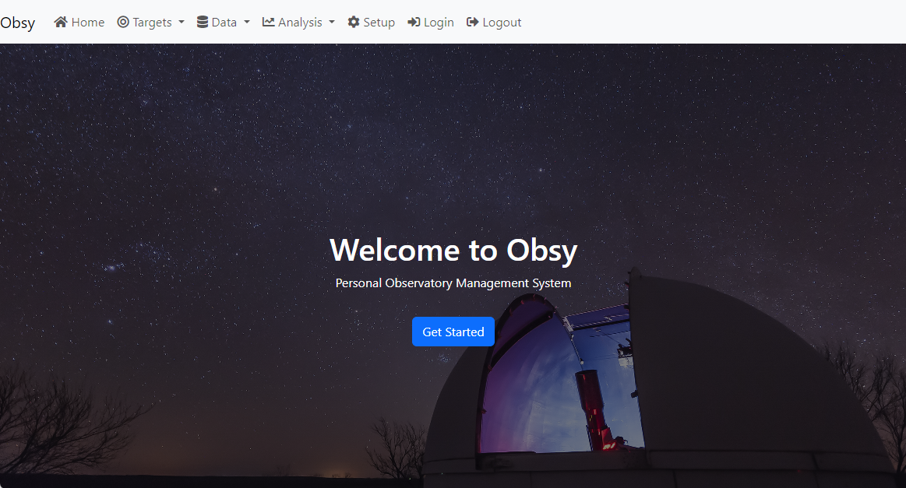

# OBSY Personal Observatory Management System

OBSY is an Open Source observatory management system intended for amateur astronomers who want to automate data collection in their observatories. The system forms a meta layer over the KStars/EKOS imaging and telescope control system, feeding nightly schedules to the EKOS Scheduler and capturing the results. 

NOTE THIS SOFTWARE IS IN ACTIVE DEVELOPMENT AND NO RELEASE CANDIDATE IS AVAILABLE YET.

## Features:
* Multinode support for seperate telescope and observatory computers
* Support for multiple workload types, all from the same code base
* Master nodes for data repository, remote nodes for web sites, telescope nodes and observatory nodes. 
* Live stacking and update of remote sites with current imaging activities
* Automatic deposits into data repositories including FITS file metadata
* Multiuser support with authentication, plus anonymous "public" access for web sites 
* Support for automated science and astrophotography imaging using KStars/EKOS on Linux
* Automated image calibration and basic processing for science and astrophotography using Siril
* Automated cloud detection from any allsky camera that can produce a current image on disk
* Support for rain detectors to automatically park the telescope and close the dome/roof of the observatory 
* Suppor for weather stations to determine if the weather is suitable for imaging operations
* Support for Smoke and Aurora forecasts to assist in determining whether imaging operations can proceed
* Automated processing of photometry imaging
* Automated processing of exoplanet imaging

## Technology Architecture
The two primary components of OBSY are:
* **MCP.py (Master Control Program(s))** is a pair of Python based services which control all integration with **INDI**, **KStars/EKOS**, Weather, Rain, **INDI-Allskycam**, and machine learning based cloud detection. There are two scripts - **oMCP.py** to run on observatory nodes, and **tMCP.py** to run on Telescope nodes. Initially this code will be very specific to my personal installation but will be generalized over time. Results are stored in a SQL database for use by the OBSY User interface, with assets (eg FITS files with images) stored in a Data Repository linked to the database. MCP will also initiate jobs such as automated master generation, calibration of images, and stacking of sequences of images (depending on target attributes) using **Siril**.
* **Obsy-Web** - using the SQL database populated by MCP operations, the web site provides a user interface where the user can select targets, view collected data, analyze and report on the data, and configure the overall system. Schedules are then created to drive MCP operations. This code is built in Python and Django.

OBSY will run on Linux/Unix environments, with all development occurring on the Stellarmate X OS, which is a Kubuntu derived distribution of Linux with bundled astronomy software and a IOS/Android app.  All code is written in Python3 with web infrastructure provided by Django. Obsy will be implicitly distributed, with four types of nodes - Master, Observatory, Telescope, and Remote. The Observatory and Telescope nodes will run complementary Python scripts that perform the workloads required. 

* The Observatory (oMCP.py) script will manage the dome or roof, allsky camera integration for cloud detection, weather and rain detectors. This code will also park and unpark the scope based on the roof state so the roof can't move unless the scope is parked. 
* The Telescope (tMCP.py) will integrate with KStars/EKOS via Dbus to operate the telescope, mount, cameras, focuser, filter wheel, etc. All workloads will be operate via EKOS Scheduler and Sequence XML files. Other post-processing will be done via local Python scripts invoked from within the EKOS Schedules and Sequences.

Initially the SQL Database will be SQLite but will be easily migrated to MySQL or Postgres. All releases will be Docker enabled.

## Current Status
Currently working on sub-projects as follows:
* OBSY - Building user interface, handling for target searching and selection, setup configuration tables (STARTED) Next will be data repository creation and management functions using initially Dropbox (because I already have an account, the functions will allow AWS etc later) Also building oMCP.py and tMCP.py scripts and testing in my backyard micro-observatory. 
* [EKOSProcessingScripts](https://github.com/gordtulloch/EKOSProcessingScripts) Scripts to use with EKOS to integrate with OBSY. For example a post-processing script that calibrates images, stores the FITS data files in a repository, and loads summary and image information into the OBSY database. (COMPLETE)
* [Photometry-Pipeline](https://github.com/gordtulloch/Photometry-Pipeline) Python script for processing of images via differential photometry (STARTED)
* [MLCloudDetect](https://github.com/gordtulloch/mlCloudDetect) Machine Learning based cloud detection for allsky cameras (COMPLETE)
* [PythonEkosFiles](https://github.com/gordtulloch/pythonEkosFiles) Python objects for reading and writing Ekos sequence and schedule files (STARTED)

## Installation
Full installation instructions will be provided when the initial release is created. Essentially the process will be to clone the repository via git and run a setup.sh script with a parameter (observatory, telescope, remote, master) to determine what the node should be configured as. Auto-discovery of nodes on the same network.
