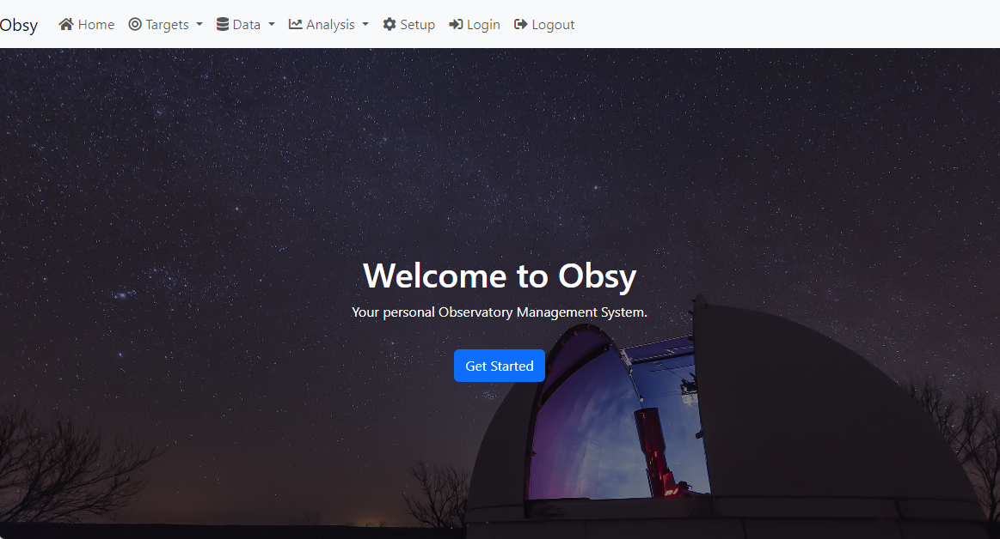

# OBSY Your Personal Observatory Management System

OBSY is an Open Source observatory management system intended for amateur astronomers who want to automate data collection in their observatories. The system forms a meta layer over the KStars/EKOS imaging and telescope control system, 
feeding nightly schedules to the EKOS Scheduler and capturing the results. 

## Roadmap
OBSY is the glue that ties together a number of sub-projects into a single cohesive system.  As such development of the OBSY system will be completed to support deployment of the sub-projects, which will initially be stand alone (and useful 
to amateur astronomers as such) then will be integrated into OBSY. Stages will be:

1. EKOS Script Integration for calibration and registration in OBSY database, including livestacking during imaging runs. Also support for calibration libraries 
2. Core Database tables maintainable through DJango
3. Target selection and scheduling setup to produce XML schedule files for EKOS nightly processing, "pretty picture" imaging
4. Master Control Project to examine current conditions (including weather station output, ML Cloud Detection, etc.), open the observatory and initiate EKOS Schedules. Watch for possible condition changes that would require schedules to be cancelled and the roof closed.
5. Photometry data reduction and reporting to AAVSO
6. Exoplanet observations and automated data reduction

## Technology Architecture
OBSY will run on Linux/Unix environments, with all development occurring on the Stellarmate X OS, which is a Debian derived distribution of Linux with bundled astronomy software and a IOS/Android app.  All code is written in Python3 with web infrastructure provided by Django. The two primary components of OBSY are:
* Python based service named MCP.py (Master Control Program) which controls all integration with INDI,KStars/EKOS, Weather, Rain, Allskycam, and cloud detection. Initially this code will be very specific to my personal installation but will be generalized over time. Results are stored in a SQL database for use by the OBSY User interface, with assets (eg FITS files with images) stored in a Data Repository linked to the database. MCP will also initiate jobs such as automated master generation, calibration of images, and stacking of sequences of images (depending on target attributes).
* Obsy web site - using the SQL database populated by MCP operations, the web site provides a user interface where the user can select targets, view collected data, analyze and report on the data, and configure the overall system. Schedules are then created to drive MCP operations. 

## Current Status
Currently working on sub-projects as follows:
* [EKOSProcessingScripts](https://github.com/gordtulloch/EKOSProcessingScripts) Scripts to use with EKOS to integrate with OBSY. For example a post-processing script that calibrates images, stores the FITS data files in a repository, and 
loads summary and image information into the OBSY database. (TESTING)
* [Photometry-Pipeline](https://github.com/gordtulloch/Photometry-Pipeline) Python script for processing of images via differential photometry (STARTED)
* [MLCloudDetect](https://github.com/gordtulloch/mlCloudDetect) Machine Learning based cloud detection for allsky cameras (COMPLETE)
* [PythonEkosFiles](https://github.com/gordtulloch/pythonEkosFiles) Python objects for reading and writing Ekos sequence and schedule files (STARTED)
